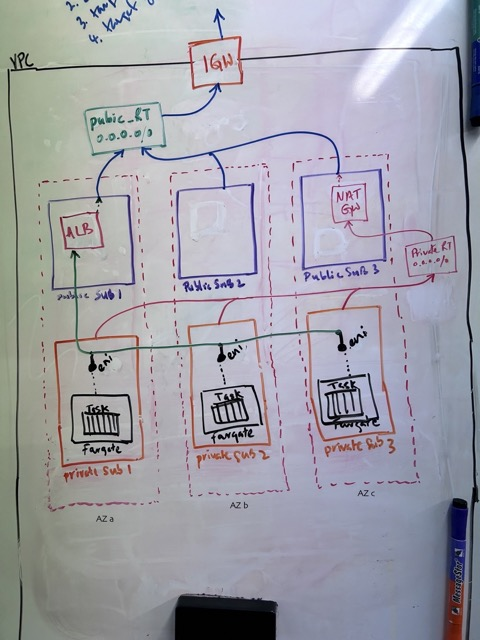

# Provisioning infra to deploy a basic HTTP web server in AWS using Terraform

This is a demo to create a simple infrastructure to deploy a basic HTTP web server using Terraform and AWS cloud provider. It consists of:

- Virtual Private Cloud (VPC) with 3 public subnets in 3 availability zones
- Elastic Container Service (ECS) using Fargate
- Application Load Balancer (ALB)
- Terraform state stored remotely (S3)

## Pre-requisites 
1. This demo implies that you already have an AWS account and Terraform CLI installed.
2. Set corresponding IAM credentials set in `~/.aws/credentials` and have permission to create and delete for all AWS resources.
3. S3 bucket pre-created to store remote state. See `main.tf` for bucket details.

## How to create the infrastructure?
1. `git clone https://github.com/yfernando/terraform-aws-demo.git`
2. `cd terraform-aws-demo`
3. `terraform init`
4. `terraform plan`
5. `terraform apply`

## How to delete the infrastructure?
1. Terminate instances
2. Run `terraform destroy`

## Brief Overview
Following sketch is the target setup I was aiming for. 



ECS cluster is created using Fargate as the launch type. This means the Docker container (`nginx`) would run in a Fargate task as I didn’t want to manage the EC2 instances and corresponding amis. Fargate is a serverless service to deploy ECS clusters generally used for transient workloads. Fargate provides native integration with VPC, IAM and provides an ENI for the tasks to communicate securely with other services.

You could run the web server in the public subnet, but it is considered a best practice and a more secure approach to run the containerized application with ECS in the private subnet. The Fargate tasks would talk to the outside world via the NAT gateway in the public subnet. The ALB in the public subnet funnels HTTP requests to the task, and the response will go via the NAT gateway.

## Improvements

1. Ran out of time to add the ALB. Will update the github repo soon.
2. Simplify the vpc setup using verified module from Terraform registry
3. Add auto-scaling based on CPU and RAM metrics
4. Add terrform state locking

## Known Issues

1. Although the ecs service gets created with the desired count of tasks, following error is thrown during `terrafrom apply` 

```
aws_ecs_service.CM_ecs_service[1]: Creating...
aws_ecs_service.CM_ecs_service[2]: Creating...
╷
│ Error: creating ECS Service (web-service): InvalidParameterException: Creation of service was not idempotent.
│
│   with aws_ecs_service.CM_ecs_service[1],
│   on ecs.tf line 20, in resource "aws_ecs_service" "CM_ecs_service":
│   20: resource "aws_ecs_service" "CM_ecs_service" {
```
This could be the offending line. 
```
    subnets = [aws_subnet.CM_subnet_private[count.index].id]
```


## Some links to resources that helped me to do this demo. Thanks! 

1. Add subnets in each AZ with element() and length()
https://www.bogotobogo.com/DevOps/Terraform/Terraform-VPC-Subnet-ELB-RouteTable-SecurityGroup-Apache-Server-1.php

2. NAT gateway use cases
https://docs.aws.amazon.com/vpc/latest/userguide/nat-gateway-scenarios.html#public-nat-internet-access

3. Deploying an AWS ECS Cluster of EC2 Instances With Terraform
https://medium.com/swlh/creating-an-aws-ecs-cluster-of-ec2-instances-with-terraform-85a10b5cfbe3

4. Provisioning VPC, ECS and ALB using Terraform
https://github.com/mashun4ek/ecs_terraform_workshop/tree/master

5. The official Terraform documentation for AWS
https://www.terraform.io/docs/providers/aws/
